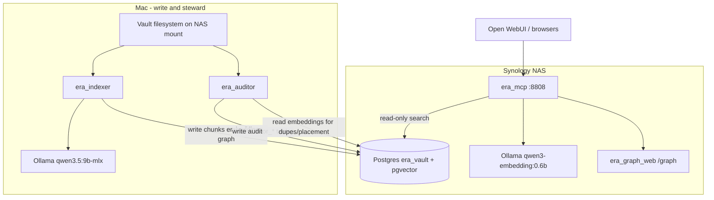

# Career SecondBrain (Era Vault)

Personal knowledge vault with RAG search, knowledge-graph exploration, and
AI-assisted cleanup. Four cooperating components share one Postgres database
(`era_vault`) and the same vault filesystem roots.

## The four agents

| Component | Role | Runs on | README |
|-----------|------|---------|--------|
| [`era_indexer`](era_indexer/) | **Write** — discover, convert, chunk, embed, graph extract | Mac | [era_indexer/README.md](era_indexer/README.md) |
| [`era_mcp`](era_mcp/) | **Read** — hybrid search, `/ask` agent, graph API | NAS Docker (:8808) | [era_mcp/README.md](era_mcp/README.md) |
| [`era_auditor`](era_auditor/) | **Steward** — vault hygiene, semantic dupes, Librarian training | Mac | [era_auditor/README.md](era_auditor/README.md) |
| [`era_graph_web`](era_graph_web/) | **Visualize** — Sigma.js graph viewer at `/graph` | Built into MCP image | [era_graph_web/README.md](era_graph_web/README.md) |

## How they work together



**Indexer** (`era_indexer`) walks vault files on the Mac, converts documents and
transcribes audio, chunks text, embeds via Ollama, and optionally extracts
entities and relationships. It writes to `file_registry`, `document_chunks`,
`parent_chunks`, graph tables, and `graph_snapshots`. The Python package inside
this folder is `career_history` (CLI: `python -m career_history.cli`).

**API server** (`era_mcp`) is the read half. It embeds incoming queries with the
same model, runs hybrid vector + full-text retrieval, and exposes OpenAPI tools
(`search_vault`, `ask_vault`, `indexing_status`, …) for Open WebUI. It never
writes chunks or embeddings. When built with the graph frontend, it serves
`era_graph_web` at `/graph`.

**Knowledge Steward** (`era_auditor`) scans the same vault roots read-only,
classifies folders, and writes findings to `auditor_*` tables. It optionally
reads indexer embeddings for semantic-duplicate detection and Librarian placement
simulation. It does not move, rename, or delete files.

**Graph viewer** (`era_graph_web`) is a frontend only. Indexer generates graph
snapshots in Postgres; MCP serves them at `GET /graph/snapshot`; the viewer
renders them with Sigma.js.

## Operational topology

| Where | What runs |
|-------|-----------|
| **Mac** | `era_indexer`, `era_auditor`, heavy LLM (`qwen3.5:9b-mlx` for graph extraction and `/ask` synthesis) |
| **Synology NAS** | Postgres + pgvector, NAS Ollama (`qwen3-embedding:0.6b` for query embeddings), `era_mcp` Docker container |

Schedule heavy indexer work on the Mac from the NAS when needed, e.g.:

```bash
ssh mac "cd ~/GitHub/Career_SecondBrain/era_indexer && \
  python -m career_history.cli update --folder Meetings"
```

## Shared contracts

Copy [`.env.example`](.env.example) to `.env` at the repo root. All four
components read `ERA_VAULT_DB_*` from this file (the auditor auto-builds its
database URL from the same vars).

| Contract | Value | Must match across |
|----------|-------|-------------------|
| Database | `era_vault` on Synology Postgres | indexer, MCP, auditor |
| DB vars | `ERA_VAULT_DB_HOST`, `PORT`, `NAME`, `USER`, `PASSWORD` | `.env` → all services |
| Embedding model | `qwen3-embedding:0.6b` (1024-dim) | Mac indexer, NAS Ollama, MCP `EMBEDDING_MODEL` |
| Vault roots | Same `source_directories` paths | `era_indexer/config.yaml`, `era_auditor/config.yaml` |
| OpenAI | `OPENAI_API_KEY`, `OPENAI_MODEL` | auditor (classification), MCP (`/ask` fallback) |

## Typical workflows

**Index new or changed files** (Mac):

```bash
cd era_indexer
python -m career_history.cli update
python -m career_history.cli status
```

**Search the vault** (via MCP on NAS, or locally on :8808):

```bash
curl -X POST http://localhost:8808/search \
  -H 'Content-Type: application/json' \
  -d '{"query":"voice authentication proposal","top_k":5}'
```

Or connect [Open WebUI](https://openwebui.com/) to `http://<host>:8808/openapi.json`.

**Refresh and view the knowledge graph**:

```bash
cd era_indexer
python -m career_history.cli graph-refresh
python -m career_history.cli graph-status
```

Then open `http://<host>:8808/graph/` in a browser.

**Run the Knowledge Steward** (Mac):

```bash
cd era_auditor
python -m auditor.cli run
python -m auditor.cli report latest
```

## Repo layout

```text
Career_SecondBrain/
├── .env.example          Shared secrets template (DB, OpenAI)
├── era_indexer/          Write pipeline (package: career_history)
├── era_mcp/              Read API server + Docker deploy
├── era_auditor/          Knowledge Steward agent
└── era_graph_web/        Graph viewer (built into era_mcp image)
```

## NAS Docker deployment notes

This repository is developed locally and pushed to GitHub. A sanitized working
copy can also be synced to the Synology NAS for Docker-based services.

Current local paths:
- Local repo: `/Users/erathiachia/GitHub/Career_SecondBrain`
- NAS mount: `/Volumes/homes/Erathia`
- NAS Docker mirror: `/Volumes/docker/Career_SecondBrain`

Do not sync secrets or machine-local artifacts:
- `.env`, `.env.*`
- real `config.yaml` files
- `.venv/`, `node_modules/`, `dist/`
- caches, `.DS_Store`, `*.tsbuildinfo`, `*.tar.gz`

Dry-run sync before deploying:

```sh
rsync -avhn --delete \
  --exclude ".git/" \
  --exclude ".env" \
  --exclude ".env.*" \
  --exclude "config.yaml" \
  --exclude ".venv/" \
  --exclude "node_modules/" \
  --exclude "__pycache__/" \
  --exclude ".pytest_cache/" \
  --exclude "dist/" \
  --exclude ".DS_Store" \
  --exclude "*.tsbuildinfo" \
  --exclude "*.tar.gz" \
  /Users/erathiachia/GitHub/Career_SecondBrain/ \
  /Volumes/homes/Erathia/Career/Career_SecondBrain/
```

Deploy the API server on the NAS from `era_mcp/`:

```bash
cd era_mcp
docker compose up -d --build
```

See [era_mcp/README.md](era_mcp/README.md) for environment variables and Open WebUI setup.
